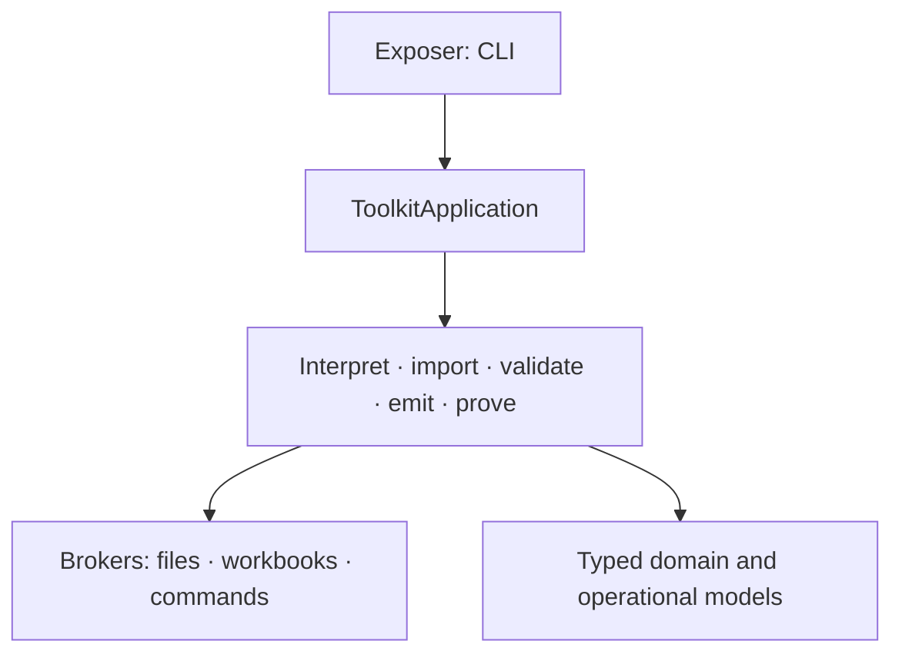
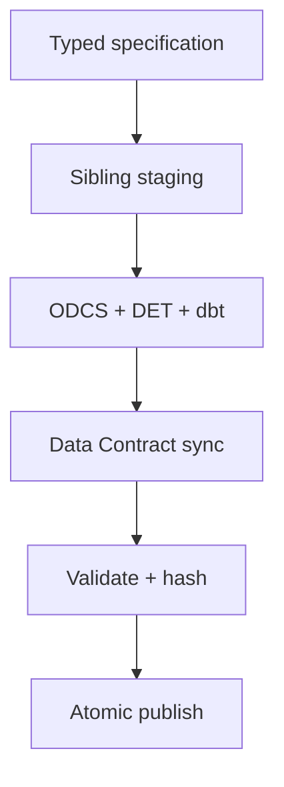

# V5.0.0 compiler architecture

The compiler is divided by responsibility so maintainers can extend one concern without
coupling workbook I/O, validation, generation, or command execution.



Dependencies point downward. The CLI parses arguments and presents results. It does not invoke
dbt, Data Contract CLI, SQLFluff, subprocesses, or openpyxl directly.

## Where changes belong

| Change | Owning code |
| --- | --- |
| Read workbook cells into the canonical IR | `services/workbooks/` |
| Parse ODCS, DDL, or a dbt manifest | `services/imports/structures.py` |
| Mutate an `.xlsx` file | `brokers/*workbooks.py` |
| Add a validation rule or diagnostic | one component in `services/validation/` |
| Add a generated artifact | one component in `services/emissions/` |
| Change staging or atomic publication | `services/generation.py`, `brokers/projects.py` |
| Add a warehouse | `adapters.py` |
| Add a command | application use case, then `exposers/cli.py` |
| Add a public dbt macro | canonical `dbt/macros/`, then regenerate the alias facade |

## Brokers

Technology dependencies live behind explicit protocols:

| Broker | Responsibility |
| --- | --- |
| `FileBroker` | atomic text/JSON reads, writes, copies, and deletion |
| `WorkbookBroker` | `.xlsx` reading into a neutral `WorkbookDocument` |
| `TemplateWorkbookBroker` | safe workbook construction and refresh |
| `SourceWorkbookEditBroker` | merge or replace imported source metadata |
| `TargetWorkbookBroker` | merge imported output schemas while preserving mappings |
| `CommandBroker` | executable discovery and subprocess execution |
| `DataContractBroker` | ODCS lint, dbt sync, and official Excel import/export |
| `DbtBroker` / `SqlFluffBroker` | dbt and SQLFluff execution |
| `ProjectWorkspaceBroker` | sibling staging and atomic project publication |

Standard ODCS Excel is deliberately not parsed by DET. `DataContractBroker.import_excel`
delegates the official format to Data Contract CLI, then the existing YAML path builds the
typed `ImportedDataStructure`.

## Services

- `WorkbookInterpretationService` converts a neutral workbook snapshot to
  `DataProductSpecification`.
- `StructureImportService` parses each external structure once, then projects it as source or
  target rows.
- `SpecificationValidationService` runs independent validators and aggregates stable
  diagnostics.
- `EmissionService` creates in-memory contract, SQL, YAML, configuration, and README artifacts.
- `ProjectGenerationService` stages output, performs Data Contract lint/sync, validates the
  synchronized result, hashes it, and publishes atomically.
- `ProjectProofService` runs an isolated end-to-end acceptance flow.

`ToolkitApplication` orchestrates those services. The installed entry point goes directly to
`dbt_data_engineering_toolkit_compiler.exposers.cli:main`; no compatibility facade modules are
part of the public Python package.

## Generation ownership



`.det-manifest.json` records compiler-owned and Data Contract-owned paths after synchronization.
It lets `det status` report exact changes, blocks unreviewed overwrites, and limits `--prune` to
unchanged generated files.

## Public dbt namespaces

`dbt_data_engineering_toolkit` is canonical. `aliases/de_toolkit/macros/facade.sql` is generated
from canonical public signatures:

```bash
python scripts/generate_alias_facade.py
python scripts/generate_alias_facade.py --check
```

The short package contains only keyword-forwarding wrappers. Third-party APIs remain behind the
canonical package boundary.

## Quality gates

```bash
python -m pip install -e "./python[test]"
python scripts/generate_alias_facade.py --check
python scripts/static_check.py
make quality
make python-coverage
make dbt-coverage
make codegen evaluator
```
