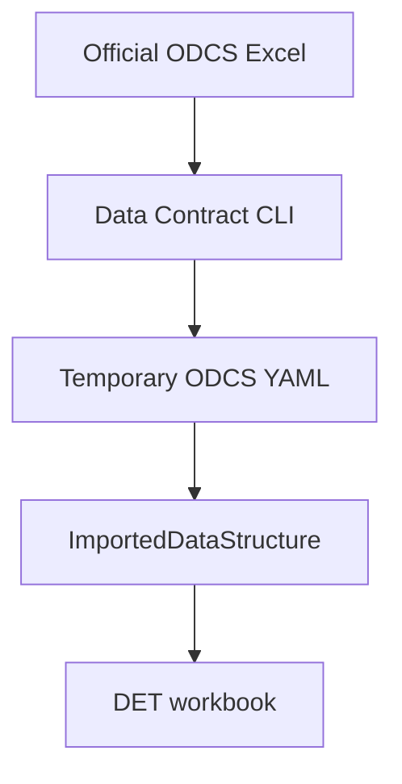

# V5.0.1 import and synchronization

All supported inputs become one typed `ImportedDataStructure`. That structure can populate
output schemas (`workbook import` / `workbook sync`) or source metadata (`source import`).

## Supported inputs

| Input | Flag | Interpretation |
| --- | --- | --- |
| ODCS YAML | `--from-contract file.yaml` | parsed by the canonical ODCS importer |
| Official ODCS Excel | `--from-contract file.xlsx` | delegated to Data Contract CLI, then parsed as canonical YAML |
| SQL DDL | `--from-ddl file.sql` | controlled `CREATE TABLE` subset |
| dbt manifest | `--from-dbt-manifest target/manifest.json` | root models, sources, columns, dependencies, and materializations |

DET intentionally does not implement an independent official-Excel parser. The flow is:



If the official Excel template changes, interpretation remains owned by Data Contract CLI.

## New workbook from an existing structure

```bash
det workbook import contracts/orders.xlsx --from-contract standard_odcs.xlsx
```

The result includes product/governance values, a schema sheet per object, target model rows,
official `Quality` rows, and preserved ODCS passthrough fields. Imported models are disabled and
mapping rows stay empty until reviewed.

## Source import

```bash
det source import \
  --workbook contracts/orders.xlsx \
  --from-ddl raw_orders.sql \
  --source-name raw \
  --relation raw_orders
```

Without `--replace`, matching rows are updated and new rows are added. With `--replace`, only the
imported source relations and their columns are replaced. Output schemas and transformation
decisions are not touched.

## Merge later changes

```bash
det workbook sync contracts/orders.xlsx --from-contract updated_orders.odcs.yaml
```

Safe defaults:

| Decision | Default | Explicit opt-in |
| --- | --- | --- |
| Multi-source demonstration rows | excluded | `--sample-customer-data` |
| Direct-copy mappings | not inferred | `--identity-mappings` |
| Imported model execution | disabled | identity mappings or manual enable |
| Removed target fields | retained | `--replace-schema` |
| Existing mappings/rules/lookups | preserved | edit in Excel |

When `--replace-schema` removes a field still referenced by a mapping, the mapping remains and
`det validate` emits an actionable diagnostic. Business logic is never silently deleted.

## ODCS preservation

Common ODCS fields populate their official sheets. Advanced product, schema, and property values
are stored in `_DET Raw ODCS`; advanced quality values use `ODCS Passthrough (JSON)` on `Quality`.
They are merged back during emission.

ODCS owns what the product promises. DET-only implementation remains separate:

- dbt layer, materialization, and ordered inputs;
- source-to-target mappings and operations;
- parameters and lookups;
- warning, quarantine, and build-failure behavior;
- adapter and published package configuration.

## dbt manifest location

From the upstream dbt project (where `dbt_project.yml` lives):

If that project's `packages.yml` uses `env_var(...)`, export its required variables first. For
toolkit-backed packages, this is typically:

```bash
export DBT_DATA_ENGINEERING_TOOLKIT_GIT_URL=https://github.com/systemizing-solutions/dbt_data_engineering_toolkit.git
```

or replace the `env_var(...)` with `"https://github.com/systemizing-solutions/dbt_data_engineering_toolkit.git"`

```bash
dbt deps --profiles-dir /absolute/path/to/profiles
dbt parse --profiles-dir /absolute/path/to/profiles
test -f target/manifest.json
```

Run `dbt parse` again after upstream metadata changes. If a custom `--target-path` is used, read
`manifest.json` from that directory.
